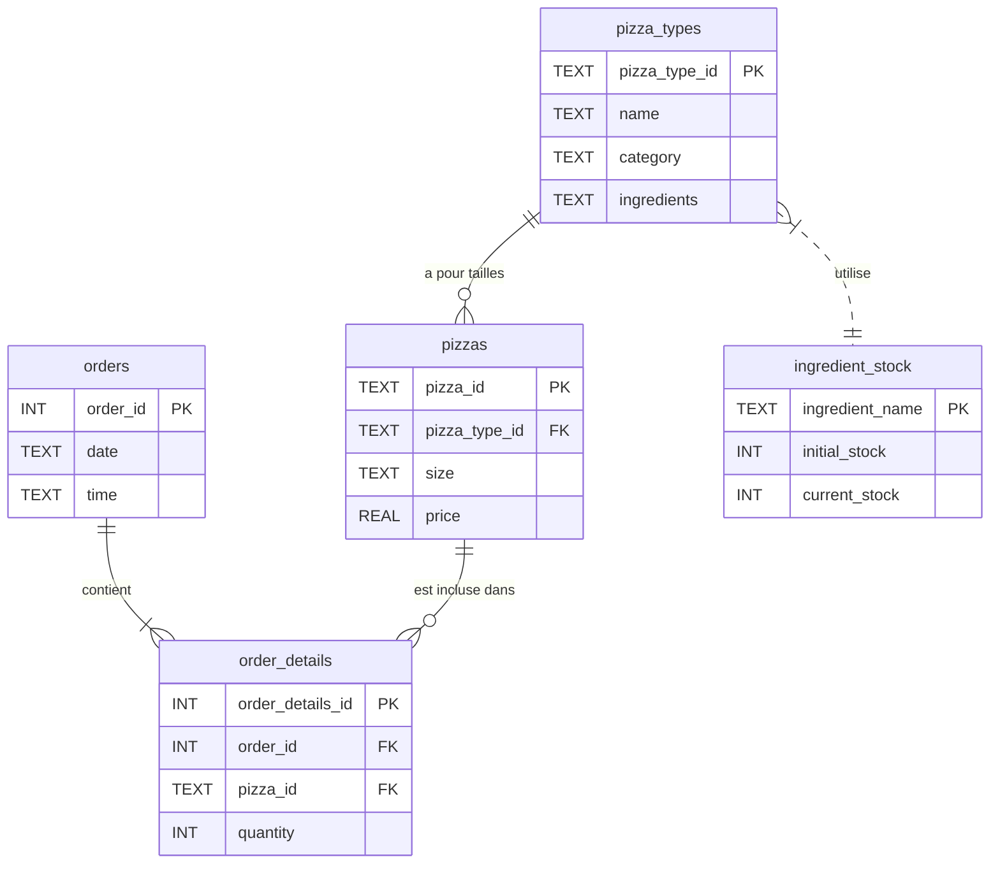
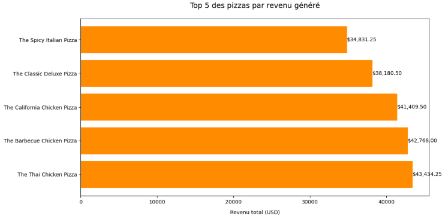

# Analyse des Ventes et Gestion des Stocks d'une Pizzeria - Projet SQL/Python

Imaginez une pizzeria qui, chaque jour, doit suivre manuellement son stock d'ingrédients, anticiper les pénuries et ajuster ses commandes en conséquence. Fastidieux, non ?

**📌Mon objectif :** automatiser ce processus avec **SQL et Python.**

## Avant de commencer
- Installer au préalable **DBCode** (c'est sur ca que le fichier notebook nommé 'AnalysePizza.dbcnb' peut s'exécuter)
- Après installation, connecter DBCode à la base sqlite
- Enfin connecter vous à la base sqlite ==> ``pizza.db``, puis exécuter le code

## Structure de la Base de Données

La base donnée se nomme ``pizza.db``; elle est **conçue** pour gérer les commandes de pizzas, les informations sur les pizzas elles-mêmes, leurs types et le stock des ingrédients. Elle est composée des tables suivantes :

### `orders`

* **Description :** Contient les informations générales de chaque commande passée.
* **Champs :**
    * `order_id` (INT, PRIMARY KEY) : Identifiant unique de chaque commande.
    * `date` (TEXT) : Date à laquelle la commande a été passée.
    * `time` (TEXT) : Heure à laquelle la commande a été passée.

### `order_details`

* **Description :** Détaille chaque pizza incluse dans une commande. Une même ligne peut représenter plusieurs pizzas identiques dans la même commande (gérées par la quantité).
* **Champs :**
    * `order_details_id` (INT, PRIMARY KEY) : Identifiant unique de chaque ligne de détail de commande.
    * `order_id` (INT, FOREIGN KEY) : Clé étrangère référençant l'identifiant de la commande dans la table `orders`.
    * `pizza_id` (TEXT, FOREIGN KEY) : Clé étrangère référençant l'identifiant de la pizza dans la table `pizzas`.
    * `quantity` (INT) : Quantité de la pizza spécifiée dans cette ligne de détail de commande.

### `pizzas`

* **Description :** Contient les informations spécifiques à chaque version de pizza (combinaison de type et de taille).
* **Champs :**
    * `pizza_id` (TEXT, PRIMARY KEY) : Identifiant unique pour chaque combinaison de type et de taille de pizza.
    * `pizza_type_id` (TEXT, FOREIGN KEY) : Clé étrangère référençant l'identifiant du type de pizza dans la table `pizza_types`.
    * `size` (TEXT) : Taille de la pizza (Small, Medium, Large, X Large, XX Large).
    * `price` (REAL) : Prix de la pizza en USD.

### `pizza_types`

* **Description :** Définit les différents types de pizzas disponibles au menu, avec leurs noms, catégories et ingrédients.
* **Champs :**
    * `pizza_type_id` (TEXT, PRIMARY KEY) : Identifiant unique pour chaque type de pizza.
    * `name` (TEXT) : Nom de la pizza tel qu'il apparaît dans le menu.
    * `category` (TEXT) : Catégorie à laquelle appartient la pizza (Classic, Chicken, Supreme, Veggie).
    * `ingredients` (TEXT) : Liste des ingrédients utilisés dans la pizza, séparés par des virgules. **Note :** Tous les types de pizzas incluent par défaut de la mozzarella et de la sauce tomate, sauf indication contraire.

### `ingredient_stock` 

* **Description :** Gère le stock actuel des différents ingrédients.
* **Champs :**
    * `ingredient_name` (TEXT, PRIMARY KEY) : Nom de l'ingrédient.
    * `initial_stock` (INTEGER, NOT NULL) : Quantité initiale de l'ingrédient en stock.
    * `current_stock` (INTEGER, NOT NULL) : Quantité actuelle de l'ingrédient en stock.
* **Contraintes :**
    * `CHECK (current_stock <= initial_stock)` : Assure que le stock actuel n'est jamais supérieur au stock initial.

### 🪢Relations entre les Tables

Le diagramme suivant illustre les relations entre les différentes tables :

**⚠ Note importante** : La relation entre la table ``pizza_types`` et la table ``ingredient_stock`` est **indirecte**. Elle se base sur la correspondance entre les noms d'ingrédients listés dans le champ ``ingredients`` de ``pizza_types`` et les ``ingredient_name`` de ``ingredient_stock``. Il n'existe pas de clé étrangère directe entre ces deux tables.

#### Et voici une petite explication des relations entre les tables et des verbes utilisés :

- ``orders`` ||--|{ ``order_details`` : **"contient"** : Chaque commande doit contenir au moins un détail de commande (au moins une pizza).

- ``pizzas`` ||--o{ ``order_details`` : **"est incluse dans"** : Chaque type de pizza (selon sa taille) peut être incluse dans zéro, une ou plusieurs commandes (une pizza spécifique peut ne pas avoir été commandée du tout, d'où le ``o{`` pour "zéro ou plusieurs").

- ``pizza_types`` ||--o{ ``pizzas`` : "a pour tailles" : Chaque type de pizza peut avoir zéro, une ou plusieurs tailles différentes proposées (un type de pizza pourrait théoriquement exister sans qu'une taille spécifique ne soit encore définie (bien que ce soit rare😅), d'où le ``o{`` ).

- ``pizza_types`` }|..|| ``ingredient_stock`` : "utilise" : Chaque type de pizza utilise certains ingrédients (relation indirecte via le champ texte).
  

## 🧱 La structure du projet :
Le projet est organisé en trois parties principales, chacune correspondant à un fichier :

1. 📁 **`schema.sql` :** Ce fichier contient le schéma de la base de données et les données initiales. Il est utilisé pour créer et initialiser la base de données.

    * **Contenu :**
        * Définition de la structure des tables :
            * `orders`
            * `pizza_types`
            * `pizzas`
            * `order_details`
            * `ingredient_stock`

        * **Initialisation** de la table `ingredient_stock` avec des instructions `INSERT`. **Note :** Les données insérées ici sont **simulées**.
        * Chargement des données à partir de fichiers CSV à l'aide des commandes SQLite `.mode csv` et `.import`.
        
        🧾 Sources des données CSV
Dataset utilisé : [mavenanalytics.io](https://mavenanalytics.io/)

    * **Rôle :** Ce fichier .sql est exécuté pour mettre en place la base de données, en créant les tables nécessaires et en y insérant les données initiales. Il s'agit du point de départ pour utiliser l'application.

    * **Fonctions SQL utilisées :**
        * `CREATE TABLE IF NOT EXISTS`
        * `PRIMARY KEY`
        * `FOREIGN KEY`
        * `REFERENCES`
        * `TEXT`, `INT`, `REAL`
        * `NOT NULL`
        * `CHECK`
        * `INSERT INTO`
        * `.mode csv` et `.import`

2.  📁 **`AnalysePizza.dbcnb` :** Ce fichier contient des requêtes SQL pour analyser les données de vente de pizzas.

    * **Contenu :**
        * Vérification de l'importation des données CSV.
        * Analyse des commandes (nombre total, par jour/heure/mois, première/dernière).
        * Analyse des ventes (nombre total de pizzas, top/flop 10 des ventes, ventes par catégorie, top 5 des revenus).
        * Analyse des prix (moyen par taille, max/min).
        * Analyse des ingrédients (liste unique, pizzas contenant un ingrédient spécifique).
        * Analyse combinée (ventes par date et catégorie).
        * Création d'une vue (`pizza_sales_summary`) et d'un index (`idx_order_pizza`).
    * **Fonctions SQL utilisées :**
        * `SELECT`, `COUNT(*)`, ``GROUP BY``, `ORDER BY`, `LIMIT`, `SUM()`, `JOIN`, `AVG()`, `MAX()`, `MIN()`, `DISTINCT`, `WHERE ... LIKE`, `strftime()`.
        * `CREATE VIEW`, `CREATE INDEX`.
    * **Rôle :** Analyse des données de vente pour fournir des informations sur les tendances, les performances et les indicateurs clés.

3.  📁 **AnalysPizza_python.ipynb :** Ce notebook (`.ipynb`) effectue une analyse approfondie des données de vente de pizzas et gère le stock des ingrédients, en s'appuyant sur la base de données créée par `schema.sql`. Il comprend les sections suivantes :

    * **Analyse des ventes de pizzas :**

        * Crée une vue (`pizza_sales_summary`) et un index (`idx_order_pizza`) pour optimiser les requêtes.

        * Calcule et visualise le top 5 des pizzas par revenu.

        * Analyse l'évolution des ventes quotidiennes.

        * Affiche la répartition des ventes par catégorie de pizza.

    * **Prévision quotidienne des ingrédients nécessaires :**

        * Extrait les pizzas commandées et leurs ingrédients à partir de la base de données.

        * Traite les données pour calculer la consommation totale de chaque ingrédient.

        * Compare la consommation avec un stock initial simulé pour détecter les pénuries.

    * **Analyse des stocks d'ingrédients :**

        * Détecte les ingrédients en dessous d'un seuil d'alerte et les affiche dans un tableau stylisé.

        * Visualise les niveaux de stock actuels à l'aide d'un graphique à barres.

        * Propose des quantités de réapprovisionnement recommandées pour les ingrédients en pénurie.

    Le notebook utilise les bibliothèques suivantes :

    * `sqlite3` : Pour interagir avec la base de données SQLite.

    * `pandas` : Pour manipuler et analyser les données.

    * `matplotlib.pyplot` : Pour créer des visualisations.

    Il est conçu pour être exécuté séquentiellement, en commençant par la **connexion à la base de données** et en terminant par l'affichage des résultats de l'analyse des stocks.

#### Petit rappelle des relations existantes entre les tables :

##### *Cette structure du projet permet de séparer clairement la définition de la base de données de la logique applicative, ce qui facilite la maintenance et l'évolution du projet.*

---

**Points Forts du Dossier** 

- Interaction SQL/Python :
    - Requêtes SQL → DataFrames Pandas → Visualisations
- Automatisation :
    - Scripts pour alerter sur les stocks bas (ingredient_stock)

---

# 🧾 Sources des données CSV
Dataset utilisé : [mavenanalytics.io](https://mavenanalytics.io/)

# 🔨Outils : 
### SQLite, DBCode, VSCode

# 👨‍🎓 Réalisé par
### BALLOGOU Essi Carole Claudia